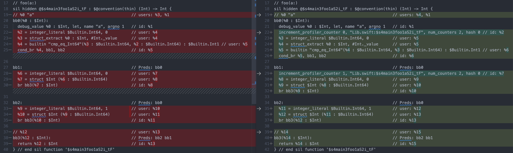
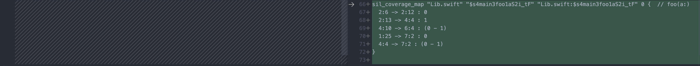
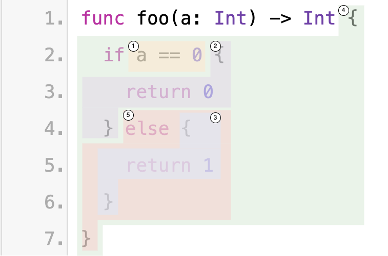

# Behind the scenes: Code Coverage
Code coverage is a software testing metric that measures the extent to which the source code of a program is executed during the testing process. It provides insights into the effectiveness of the testing efforts by indicating which parts of the code have been tested and which parts have not. (*written by ChatGPT*)

In this article we will deep dive the code coverage in Swift/LLVM.

## Build and Run
To get code coverage, we need a binary with instrument code, which requires extra flags to the compiler and linker.
* clang: `-fcoverage-mapping -fprofile-instr-generate`
* swiftc: `-profile-coverage-mapping -profile-generate`
* ld: `-fprofile-instr-generate`

When running the binary, wet set `LLVM_PROFILE_FILE` environment variable to specify where we want the instrument data to be. After running, we will get `.profraw` files, which can be processed by [`llvm-profdata`](https://llvm.org/docs/CommandGuide/llvm-profdata.html) and [`llvm-cov`](https://llvm.org/docs/CommandGuide/llvm-cov.html) to generate the coverage report.

I have sample code [here](../testing/code_coverage) to demonstrate the entire process of building, running and showing the coverage.

## Behind the scenes
A good way to understand how coverage works is to learn how those extra compiler flags affect the binary. It's very hard to examine the binary directly, but we can build the a sample code to SIL (Swift Intermediate Language, which is much more human readable), and see the differences before and after adding those flags.

```swift
// Lib.swift
func foo(a: Int) -> Int {
  if a == 0 {
    return 0
  } else {
    return 1
  }
}
```
```bash
$ xcrun swiftc -emit-sil Lib.swift -o Lib.sil.1
$ xcrun swiftc -emit-sil Lib.swift -o Lib.sil.2 -profile-coverage-mapping -profile-generate
```

Now just use any diffing tool to see the difference between `Lib.sil.1` and `Lib.sil.2`.



As we can tell from the diff, with the coverage flags, two `increment_profiler_counter` are inserted into two different code blocks. As the name suggests, they are counters, literally counting how many times that code block got executed. There is a coverage map added at the end, mapping the source regions to the counter. A source region is defined by the line and column number of the beginning and ending position. `2:6 -> 2:12 : 0` means the region from Ln2,Col6 to Ln2,Col12 maps to counter 0. `(0 - 1)` means counter 0 minus counter 1. The sample code have five regions and two counters, shown in the below graph.

| region | counter |
| --  | -- |
| | region 1 -> counter0<br/>region 2 -> counter1<br/>region 3 -> counter0 - counter1<br/>region 4 -> counter0<br/>region 5 -> counter0 - counter 1<br/>|

In the form of pseudo code, this is how what above sample code is compiled to.

```swift
func foo(a: Int) -> Int {
  if [counter0++] a == 0 {
    [coutner1++]
    return 0
  } else {
    return 1
  }
}
```

After running the binary, we will have the numbers from every counter. Then a tool (e.g. `llvm-cov`) can calculate how many times each region has been executed. Therefore, we can get the coverage information.

### Coverage Sections in Binary
With the extra compiler flags, multiple segments and sections are added in the Mach-O binary to support running coverage. Here is a list of these sections.

* `__DATA,__llvm_prf_cnts`
* `__DATA,__llvm_prf_data`
* `__DATA,__llvm_prf_names`
* `__DATA,__llvm_prf_vnds`
* `__DATA,__llvm_orderfile`
* `__LLVM_COV,__llvm_covfun`
* `__LLVM_COV,__llvm_covmap`

#### __llvm_covmap
In the modern version, this section just stores a list of filenames. The parsing logic can be found [here](../macho_parser/sources/llvm_cov.cpp). The actual mapping is stored in `__llvm_covfun`.
```
CovMap Header: (NRecords: 0, FilenamesSize: 31, CoverageSize: 0, Version: 5)
    Filenames: (NFilenames: 2, UncompressedLen: 25, CompressedLen: 28)
      0: ./Test.swift
      1: ./Lib.swift
```

#### __llvm_covfun
This section restores function records, which contains the region-to-counter mapping mentioned above. There is one record per function. The parsing logic can be found [here](../macho_parser/sources/llvm_cov.cpp).
```
0: FuncNameHash: 0x8793d595ad4c2cdb, DataLen: 36, FuncHash: 0x0, FileNameHash: 0xbcb137dd4d3ff841
    FileIDMapping: (NFiles: 1)
      0: 1
    MappingRegions: (NRegionArrays: 1)
      0: (NRegions: 6)
         0: 2:31 => 8:6 : 0
         1: 3:12 => 3:18 : 0
         2: 3:19 => 5:10 : 1
         3: 5:10 => 8:6 : (0 - 1)
         4: 5:16 => 7:10 : (0 - 1)
```

## Conclusion
Overall, LLVM code coverage operates by instrumenting the code, collecting execution data, mapping it back to the original source code, and generating reports to provide insights into the coverage achieved during testing. (*written by ChatGPT*)

One thing to note, code coverage isn't limit to tests. Any executable code can have coverage.

## References
* [Source-based Code Coverage](https://clang.llvm.org/docs/SourceBasedCodeCoverage.html)
* [LLVM Code Coverage Mapping Format](https://llvm.org/docs/CoverageMappingFormat.html#coverage-mapping-counter)
* [A coverage bug we filed to Swift](https://github.com/apple/swift/issues/65964)
