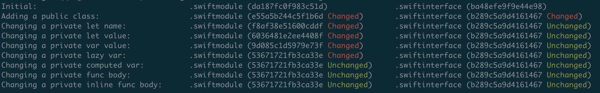

# Swift Module (`.swiftmodule`)

A `.swiftmodule` file is a binary representation of a Swift module's interface, generated by the Swift compiler. It serves as a serialized form of the module's public API and is used during Swift module imports to provide type information.

## Viewing `.swiftmodule` Contents

The `.swiftmodule` file is encoded in the [LLVM Bitstream](https://llvm.org/docs/BitCodeFormat.html) format, a compact and efficient binary format extensively used by the Swift compiler. [The Swift Serialization documentation](https://github.com/swiftlang/swift/blob/main/docs/Serialization.md) in the Swift repository provides a high-level overview of the file format and its contents.

While tools like `llvm-bcanalyzer` can parse general Bitstream structures, and `sil-opt` can print the SIL section, AFAIK there’s no tool that can decode the full contents of `.swiftmodule` files in a human-readable way.

* Print out general Bitstream block and record information
```bash
llvm-bcanalyzer Foo.swiftmodule
```

* Print the embedded SIL
```bash
sil-opt -emit-sorted-sil Foo.swiftmodule
```

* Another way to print the SIL
```bash
# "-I ." is for the search path to locate Foo.swiftmodule
swift-ide-test -print-module -source-filename=Foo.swift -module-to-print=Foo -I .
```

*(All tools above need to be built from the [Swift source](https://github.com/swiftlang/swift).)*

## What Source Changes Affect `.swiftmodule`

When a module imports another module—for example, `import Foo`—it depends on `Foo.swiftmodule` to build. If `Foo.swiftmodule` changes, all modules that depend on it must be rebuilt. Understanding what kinds of source changes cause `.swiftmodule` to change is therefore critical for optimizing build performance, especially in large codebases.

To explore this, I made a variety of source modifications, built the module using `swiftc -emit-module`, and compared the resulting `.swiftmodule` checksums. The screenshot below shows the result and you can find the full script [here](../building/swift_module/swiftmodule_changes.sh).



### Key Findings

Surprisingly, although `.swiftmodule` is meant to represent the public interface, many changes to private elements also cause it to change.

For example, modifying the value of a private variable like the one below will result in a change to the `.swiftmodule`:
```swift
class Foo {
  private var privateVar = 1
}
```

Based on testing, only changes within function bodies or computed property bodies do **not** affect the `.swiftmodule`. However, changes to constants, stored variables, or lazy variables **do** affect it, regardless of their access control level (public, private, etc.) or containing type (class or struct).

This behavior has a notable impact on build performance—especially when editing foundational modules that many other modules depend on.

### A Workaround (Not Recommended)

Because of this behavior, we may try to reduce `.swiftmodule` changes by restructuring code. For instance, instead of writing:
```swift
class Foo {
  lazy private var privateLazyVar = {
    return "aaa"
  }()
}
```

One might use a private function to wrap the logic:
```swift
class Foo {
  lazy private var privateLazyVar = {
    return privateFunc()
  }()

  private func privateFunc() -> String {
    return "aaa"
  }
}
```

This pattern avoids changing the `.swiftmodule` when modifying the string `"aaa"`, as changes within function bodies don't affect the module interface. However, sacrificing code clarity and maintainability solely to optimize build performance is generally not recommended.
