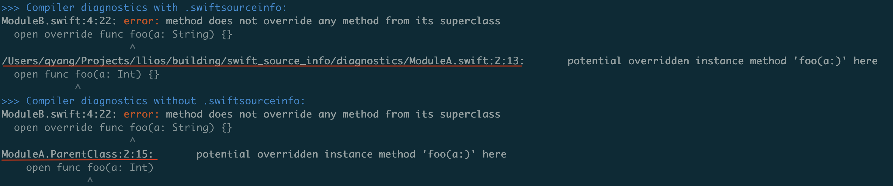

# Swift Source Info (`.swiftsourceinfo`)
The `.swiftsourceinfo` file is generated by the Swift compiler during compilation. It is emitted alongside `.swiftmodule` and `.swiftdoc` when the `-emit-module` flag is present. As its name suggests, this file records the Swift source information of a Swift module, including file paths, timestamps, symbol (USR) declarations, and more.

The `.swiftsourceinfo` file is used to enhance diagnostics, indexing, and potentially debugging. However, it always [embeds the absolute paths](https://github.com/apple/swift/blob/c2ca810126074406f03dc29a44f4ad4b12f04c79/lib/Serialization/SerializeDoc.cpp#L765-L767). If the file is downloaded from a remote cache, local indexing is also hindered. Therefore, [a tool](https://github.com/qyang-nj/source-info-import) is needed to remap the source paths.

## The Usage
Since `.swiftsourceinfo` is considered an implementation detail of the compiler, there is limited documentation available regarding its usage and format. However, I have managed to gather some insights from online discussions and my own investigations.

### Diagnostics
Based on the initial [proposal](https://forums.swift.org/t/proposal-emitting-source-information-file-during-compilation/28794), the `.swiftsourceinfo` file was introduced to enhance diagnostics, also known as compiler error messages. Within the Swift source code, I discovered [a test case](https://github.com/apple/swift/blob/17ca88c94a34b34c3c354891e899e82ce98f46ee/test/diagnostics/multi-module-diagnostics.swift), of which a simplified version is presented [here](../building/swift_source_info/diagnostics/).
``` swift
// ModuleA.swift
open class ParentClass {
  open func foo(a: Int) {}
}

// ModuleB.swift
import ModuleA

open class SubClass: ParentClass {
  open override func foo(a: String) {}
}
```

Here are the error messages with and without the `.swiftsourceinfo` file.

In Xcode, having the full path and line number enables us to double-click the error message to jump directly to the corresponding file. Without `.swiftsourceinfo`, this functionality is not available.

### Indexing
During my investigation, I discovered that swift source info is utilized by SourceKit to enhance indexing-related features. For instance, in the code example below, attempting to jump to the definition of the symbol `foo` will not succeed without `.swiftsourceinfo`, even if the IndexStore is fully populated. This is because `foo` is a synthesized symbol (`s:10Foo0A8ProtocolPA2A0A6StructVRszrlE3fooSSvpZ::SYNTHESIZED::s:10Foo0A6StructV`). This particular symbol can be observed in both the SourceKit logs and the generated symbol graph JSON file.

```swift
// Foo.swift
public protocol FooProtocol {}
public struct FooStruct : FooProtocol {}

extension FooProtocol where Self == FooStruct {
  public static var foo: String {
    "Hello, world!"
  }
}

// In another module
print(FooStruct.foo)
```

### Debugging
The `.swiftsourceinfo` file could also be utilized by the debugger, but I have yet to find a specific case to confirm this.

## The File Format
> [!WARNING]
> The format of `.swiftsourceinfo` is not guaranteed to be stable. It may change across different compiler versions. The following content is verified with Swift 5.9 and 5.10.

Like everything else in LLVM and Swift, `.swiftsourceinfo` file is in a [LLVM Bitstream](https://llvm.org/docs/BitCodeFormat.html#bitstream-format) binary format. Using `llvm-bcanalyzer`, we can see its high level block structure.

```
$ llvm-bcanalyzer -dump Foo.swiftsourceinfo
<BLOCKINFO_BLOCK/>
<MODULE_SOURCEINFO_BLOCK NumWords=281 BlockCodeSize=2>
  <CONTROL_BLOCK NumWords=36 BlockCodeSize=3>
    <METADATA abbrevid=5 op0=3 op1=0 op2=0 op3=0 op4=0 op5=0 op6=0 op7=0/> blob data = 'Apple Swift version 5.10 (swiftlang-5.10.0.13 clang-1500.3.9.4)'
    <MODULE_NAME abbrevid=4/> blob data = 'Foo'
    <TARGET abbrevid=6/> blob data = 'arm64-apple-macosx14.0'
  </CONTROL_BLOCK>
  <DECL_LOCS_BLOCK NumWords=240 BlockCodeSize=4>
    <SOURCE_FILE_LIST abbrevid=4/> blob data = unprintable, 84 bytes.
    <BASIC_DECL_LOCS abbrevid=5/> blob data = unprintable, 460 bytes.
    <DECL_USRS abbrevid=6 op0=252/> blob data = unprintable, 292 bytes.
    <TEXT_DATA abbrevid=7/> blob data = unprintable, 75 bytes.
    <DOC_RANGES abbrevid=8/> blob data = unprintable, 1 bytes.
  </DECL_LOCS_BLOCK>
</MODULE_SOURCEINFO_BLOCK>
```

However, if we want to understand more details, we need to look into the Swift source code. The serializing logic starts at [here](https://github.com/apple/swift/blob/279e147ae2ddeaf609b45a089b7acd77a00c5049/lib/Frontend/Serialization.cpp#L174) and the deserializing logic starts at [here](https://github.com/apple/swift/blob/c2ca810126074406f03dc29a44f4ad4b12f04c79/lib/Serialization/SerializedModuleLoader.cpp#L302).

> [!NOTE]
> The term [Block](https://llvm.org/docs/BitCodeFormat.html#blocks) and [Record](https://llvm.org/docs/BitCodeFormat.html#data-records) are the general LLVM Bitstream terms.


### MODULE_SOURCEINFO_BLOCK
`MODULE_SOURCEINFO_BLOCK` is the only core block that a `.swiftsourceinfo` file has. It contains two sub blocks, `CONTROL_BLOCK` and `DECL_LOCS_BLOCK`.

* [Serializing MODULE_SOURCEINFO_BLOCK](https://github.com/apple/swift/blob/c2ca810126074406f03dc29a44f4ad4b12f04c79/lib/Serialization/SerializeDoc.cpp#L880-L909)
* [Parsing MODULE_SOURCEINFO_BLOCK](https://github.com/apple/swift/blob/c2ca810126074406f03dc29a44f4ad4b12f04c79/lib/Serialization/ModuleFileSharedCore.cpp#L1232-L1299)

#### CONTROL_BLOCK
`CONTROL_BLOCK` has three records for the basic compilation information: the module name (e.g. FooModule), the compiler version (e.g. Apple Swift version 5.9.2), and the target triple (e.g. arm64-apple-ios17.2-simulator).

* [Serializing CONTROL_BLOCK](https://github.com/apple/swift/blob/c2ca810126074406f03dc29a44f4ad4b12f04c79/lib/Serialization/SerializeDoc.cpp#L856-L877)

#### DECL_LOCS_BLOCK
`DECL_LOCS_BLOCK` is much more interesting than `CONTROL_BLOCK` and has all the source information. It consists of five records, which are binary blob and opaque to the end users.
* [Parsing DECL_LOCS_BLOCK](https://github.com/apple/swift/blob/c2ca810126074406f03dc29a44f4ad4b12f04c79/lib/Serialization/ModuleFileSharedCore.cpp#L1169-L1230)

##### SOURCE_FILE_LIST
`SOURCE_FILE_LIST` contains a list of fixed-size item, with each containing source file information.
```c
struct SourceFileRecord {
  uint32_t FileID;           // the offset to TEXT_DATA, indicating the file path
  uint8_t  Fingerprint1[32]; // hash of interface including type members
  uint8_t  Fingerprint2[32]; // hash of interface excluding type members
  uint64_t Timestamp;
  uint64_t FileSize;
};
```
* [Serializing SOURCE_FILE_LIST](https://github.com/apple/swift/blob/c2ca810126074406f03dc29a44f4ad4b12f04c79/lib/Serialization/SerializeDoc.cpp#L752)
* [Parsing SOURCE_FILE_LIST](https://github.com/apple/swift/blob/c2ca810126074406f03dc29a44f4ad4b12f04c79/lib/Serialization/ModuleFile.cpp#L1089-L1141)

##### BASIC_DECL_LOCS
`BASIC_DECL_LOCS` consists of a list of fixed-size item, with each representing a location of a USR declaration.
```c
// The layout of one record item
struct DeclLocRecord {
  uint32_t FileID;          // the offset to TEXT_DATA, indicating the file path
  uint32_t DocRangeID;      // the offset to DocRangeRecord, indicating the documentation location.
  struct {
    uint32_t Offset;
    uint32_t Line;
    uint32_t Column;
    struct {
      uint32_t Offset;
      uint32_t LineOffset;
      uint32_t Length;
      uint32_t FileID;     // the offset to TEXT_DATA, indicating the file path
    } Directive;           // ExternalSourceLocs::LocationDirective
  } RawLoc[3];             // ExternalSourceLocs::RawLoc, Loc/StartLoc/EndLoc
};
```
* [Serializing BASIC_DECL_LOCS](https://github.com/apple/swift/blob/c2ca810126074406f03dc29a44f4ad4b12f04c79/lib/Serialization/SerializeDoc.cpp#L734-L750)
* [Parsing BASIC_DECL_LOCS](https://github.com/apple/swift/blob/c2ca810126074406f03dc29a44f4ad4b12f04c79/lib/Serialization/ModuleFile.cpp#L1199-L1222)
* The `LocationDirective` is related to the usage of `#sourceLocation`

##### DECL_USRS
`DECL_USRS` is a serialized  `llvm::OnDiskIterableChainedHashTable`, where the key is a USR, and the value is the index of a location record in `BASIC_DECL_LOCS`. Virtually, the deserialized `DECL_USRS` looks like below.
```
s:10Foo0A8ProtocolPA2A0A6StructVRszrlE3fooSSvpZ -> 4
s:10Foo0A6StructV -> 2
s:10Foo0A8ProtocolPA2A0A6StructVRszrlE3fooSSvgZ (Foo.swift:10:33) -> 3
s:10Foo0A8ProtocolP -> 1
s:10Foo3BarC -> 0
s:e:s:10Foo0A8ProtocolPA2A0A6StructVRszrlE3fooSSvpZ -> 5
```
* [Serializing DECL_USRS](https://github.com/apple/swift/blob/c2ca810126074406f03dc29a44f4ad4b12f04c79/lib/Serialization/SerializeDoc.cpp#L550-L562)
* [Parsing DECL_USRS](https://github.com/apple/swift/blob/c2ca810126074406f03dc29a44f4ad4b12f04c79/lib/Serialization/ModuleFileSharedCore.cpp#L1157-L1167)

##### TEXT_DATA
`TEXT_DATA` is a list of `\0` terminated strings, which are the actual source file paths. As mentioned before, they’re [always absolute paths](https://github.com/apple/swift/blob/c2ca810126074406f03dc29a44f4ad4b12f04c79/lib/Serialization/SerializeDoc.cpp#L760-L762).

##### DOC_RANGES
`DOC_RANGES` is a list of fixed-size item, representing the the location of documentation. A documentation is a code comment in a [DocC format](https://www.swift.org/documentation/docc/documenting-a-swift-framework-or-package). The layout of doc range for a USR is described below.
```c
uint32_t nums;          // The number (N) of DocRangeRecord followed by this
struct {
  struct {
    ...                 // 7 uint32_t fields, same layout as the RawLoc in DeclLocRecord
  } RawLoc;
  uint32_t Unknown;     // Unknown what is this used for
} DocRangeRecord[N];    // N DocRangeRecord
```
* [Parsing DOC_RANGES](https://github.com/apple/swift/blob/c2ca810126074406f03dc29a44f4ad4b12f04c79/lib/Serialization/ModuleFile.cpp#L1206-L1217)

### Conclusion
The way the source info is stored facilitates workflows such as finding the definition (jump-to-definition) and documentation (showing the help window) of a given USR.

