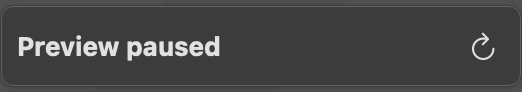

# Behind the scenes: SwiftUI Previews
SwiftUI was first announced in WWDC 2019, and SwiftUI Previews was shipped with Xcode since version 11. It’s intriguing to me that how Swift can act like Javascript in a browser, so I did some investigations. I certainly don’t know it inside out, but I’d like to document some interesting observations.

In this article, the module of interest is called `SamplePreview`  and its build target is `SamplePreview.framework` . The file that contains SwiftUI code is `MySwiftUIView.swift`.

## System Supports
Xcode ships quite a few apps and frameworks to support SwiftUI Previews.

### Apps
There are two apps that play essential roles, `Xcode Previews` and `XCPreviewAgent`. These apps are built to run on simulators.

* `Xcode Previews.app`
  * The frontend app that shows the UI. This app can actually be installed in a simulator.
* `XCPreviewAgent.app`
  * A deamon app that talks to `Xcode Previews` through XPC.

### Frameworks
Besides the two apps, there are a ton of frameworks to support Previews. Some of them are used by Xcode itself, some of them are used on a simulator, and some of them are for both. I found them through the `LC_LOAD_DYLIB` of the Mach-O files.

* `PreviewsXcode.framework`
* `PreviewsDeveloperTools.framework`
* `PreviewsFoundation.framework`
* `PreviewsMessaging.framework`
* `PreviewsModel.framework`
* `PreviewsPipeline.framework`
* `PreviewsPlatforms.framework`
* `PreviewsScenes.framework`
* `PreviewsUI.framework`
* `PreviewsXcodeUI.framework`
* `PreviewsInjection.framework`
* `PreviewsOSSupport.framework`
* `PreviewsOSSupportUI.framework`
* `PreviewsServices.framework`
* `PreviewsServicesUI.framework`

## Generated Code
After the preview is rendered, if we examine the Derived Data, we will find some interesting files generated by Xcode for the preview purpose.

```plaintext
${DERIVED_DATA}/Build/Intermediates.noindex/Previews/SamplePreview/Intermediates.noindex/SamplePreview.build/Debug-iphonesimulator/SamplePreview.build
├── DerivedSources
│ └── SamplePreview_vers.c
└── Objects-normal
   └── arm64
      ├── MySwiftUIView.1.preview-thunk.swift
      ├── MySwiftUIView.1.preview-thunk.dylib
      └── (other intermediates files)
```

<details>
  <summary>MySwiftUIView.swift (original source)</summary>

```swift
import SwiftUI

struct MySwiftUIView: View {
  var body: some View {
    VStack(spacing: 8) {
      Text("Hello")
      Text("World")
    }
  }
}

struct MySwiftUIView_Previews: PreviewProvider {
  static var previews: some View {
    MySwiftUIView()
  }
}
```
</details>

<details>
  <summary>MySwiftUIView.1.preview-thunk.swift</summary>

```swift
@_private(sourceFile: "MySwiftUIView.swift") import SamplePreview
import SwiftUI
import SwiftUI

extension MySwiftUIView_Previews {
    @_dynamicReplacement(for: previews) private static var __preview__previews: some View {
        #sourceLocation(file: "/Users/qyang/Projects/SamplePreview/SamplePreview/MySwiftUIView.swift", line: 17)
    MySwiftUIView()

#sourceLocation()
    }
}

extension MySwiftUIView {
    @_dynamicReplacement(for: body) private var __preview__body: some View {
        #sourceLocation(file: "/Users/qyang/Projects/SamplePreview/SamplePreview/MySwiftUIView.swift", line: 8)
    VStack(spacing: __designTimeInteger("#6017.[1].[0].property.[0].[0].arg[0].value", fallback: 8)) {
      Text(__designTimeString("#6017.[1].[0].property.[0].[0].arg[1].value.[0].arg[0].value", fallback: "Hello"))
      Text(__designTimeString("#6017.[1].[0].property.[0].[0].arg[1].value.[1].arg[0].value", fallback: "World"))
    }

#sourceLocation()
    }
}

import struct SamplePreview.MySwiftUIView
import struct SamplePreview.MySwiftUIView_Previews
```
</details>

<details>
  <summary>SamplePreview_vers.c</summary>

```cpp
 extern const unsigned char SamplePreviewVersionString[];
 extern const double SamplePreviewVersionNumber;

 const unsigned char SamplePreviewVersionString[] __attribute__ ((used)) = "@(#)PROGRAM:SamplePreview  PROJECT:SampleProject-1" "\n";
 const double SamplePreviewVersionNumber __attribute__ ((used)) = (double)1.;
```
</details>

(Before Xcode 14, there is another file `MySwiftUIView.5.preview-thunk.swift` is generated.)

From the generated files, we can see some Swift features are used.

- `@_dynamicReplacement` 
    - This is the native Swift swizzling. There are plenty of articles online talking about this. The TL;DR is that the `previews` and other properties will be replaced by the generated code at runtime.
- `__designTime*` (`__designTimeString`, `__designTimeInteger`, `__designTimeSelection`, etc) 
    - I don’t know how those work exactly, especially for the mysterious strings, like `#6017.[3].[0].property.[0].[0].arg[1].value.[3].modifier[1].arg[0].value`. My guess is that it’s sort of key used in the XPC payload, so that we can get values without rebuilding.
- `#sourceLocation` 
    - This lets debugger know where the original code is. We certainly don’t want to debug the generated code.

## Compilation
From the Xcode build panel, there are two types of builds, the regular built and the preview build.


When building for previews, the environment variable `ENABLE_PREVIEWS` is set to `YES`. By comparing the build logs, I found that building for previews has some extra compiler flags to `swiftc` . Basically they enable the dynamic replacement feature.

- `-Xfrontend -enable-implicit-dynamic` 
- `-Xfrontend -enable-private-imports` 
- `-Xfrontend -enable-dynamic-replacement-chaining` 

Also, the generated code needs to be compiled too, but the command didn't show up in the build logs. We can set `SWIFT_EXEC` and `LD` to stub the default tool and output the flags into a log file.


<details>
  <summary>Compile MySwiftUIView.1.preview-thunk.swift</summary>

```plaintext
swiftc
-F /Applications/Xcode.app/Contents/SharedFrameworks-iphonesimulator
-enforce-exclusivity=checked
-DDEBUG
-sdk /Applications/Xcode.app/Contents/Developer/Platforms/iPhoneSimulator.platform/Developer/SDKs/iPhoneSimulator15.4.sdk
-target arm64-apple-ios15.4-simulator
-module-cache-path /Users/qyang/Library/Developer/Xcode/DerivedData/ModuleCache.noindex
-Xfrontend -serialize-debugging-options
-enable-testing
-swift-version 5
-I ${DERIVED_DATA}/Build/Intermediates.noindex/Previews/SamplePreview/Products/Debug-iphonesimulator
-F ${DERIVED_DATA}/Build/Intermediates.noindex/Previews/SamplePreview/Products/Debug-iphonesimulator
-c
-j10
-serialize-diagnostics
-Xcc -I${DERIVED_DATA}/Build/Intermediates.noindex/Previews/SamplePreview/Intermediates.noindex/SamplePreview.build/Debug-iphonesimulator/SamplePreview.build/swift-overrides.hmap
-Xcc -iquote
-Xcc ${DERIVED_DATA}/Build/Intermediates.noindex/Previews/SamplePreview/Intermediates.noindex/SamplePreview.build/Debug-iphonesimulator/SamplePreview.build/SamplePreview-generated-files.hmap
-Xcc -I${DERIVED_DATA}/Build/Intermediates.noindex/Previews/SamplePreview/Intermediates.noindex/SamplePreview.build/Debug-iphonesimulator/SamplePreview.build/SamplePreview-own-target-headers.hmap
-Xcc -I${DERIVED_DATA}/Build/Intermediates.noindex/Previews/SamplePreview/Intermediates.noindex/SamplePreview.build/Debug-iphonesimulator/SamplePreview.build/SamplePreview-all-non-framework-target-headers.hmap
-Xcc -ivfsoverlay
-Xcc ${DERIVED_DATA}/Build/Intermediates.noindex/Previews/SamplePreview/Intermediates.noindex/SamplePreview.build/Debug-iphonesimulator/SamplePreview.build/all-product-headers.yaml
-Xcc -iquote
-Xcc ${DERIVED_DATA}/Build/Intermediates.noindex/Previews/SamplePreview/Intermediates.noindex/SamplePreview.build/Debug-iphonesimulator/SamplePreview.build/SamplePreview-project-headers.hmap
-Xcc -I${DERIVED_DATA}/Build/Intermediates.noindex/Previews/SamplePreview/Products/Debug-iphonesimulator/include
-Xcc -I${DERIVED_DATA}/Build/Intermediates.noindex/Previews/SamplePreview/Intermediates.noindex/SamplePreview.build/Debug-iphonesimulator/SamplePreview.build/DerivedSources-normal/arm64
-Xcc -I${DERIVED_DATA}/Build/Intermediates.noindex/Previews/SamplePreview/Intermediates.noindex/SamplePreview.build/Debug-iphonesimulator/SamplePreview.build/DerivedSources/arm64
-Xcc -I${DERIVED_DATA}/Build/Intermediates.noindex/Previews/SamplePreview/Intermediates.noindex/SamplePreview.build/Debug-iphonesimulator/SamplePreview.build/DerivedSources
-Xcc -DDEBUG=1
-Xcc -ivfsoverlay
-Xcc ${DERIVED_DATA}/Build/Intermediates.noindex/Previews/SamplePreview/Intermediates.noindex/SamplePreview.build/Debug-iphonesimulator/SamplePreview.build/unextended-module-overlay.yaml
-Xcc -working-directory/Users/qyang/Projects/SamplePreview/SamplePreview
${DERIVED_DATA}/Build/Intermediates.noindex/Previews/SamplePreview/Intermediates.noindex/SamplePreview.build/Debug-iphonesimulator/SamplePreview.build/Objects-normal/arm64/MySwiftUIView.1.preview-thunk.swift
-o ${DERIVED_DATA}/Build/Intermediates.noindex/Previews/SamplePreview/Intermediates.noindex/SamplePreview.build/Debug-iphonesimulator/SamplePreview.build/Objects-normal/arm64/MySwiftUIView.1.preview-thunk.o
-module-name SamplePreview_PreviewReplacement_MySwiftUIView_1
-Onone
-Xfrontend -disable-modules-validate-system-headers
-gline-tables-only
```
</details>

<details>
  <summary>Link MySwiftUIView.1.preview-thunk.dylib</summary>

```plaintext
clang
-F /Applications/Xcode.app/Contents/SharedFrameworks-iphonesimulator
-target arm64-apple-ios15.4-simulator
-isysroot /Applications/Xcode.app/Contents/Developer/Platforms/iPhoneSimulator.platform/Developer/SDKs/iPhoneSimulator15.4.sdk
-L${DERIVED_DATA}/Build/Intermediates.noindex/Previews/SamplePreview/Products/Debug-iphonesimulator
-F${DERIVED_DATA}/Build/Intermediates.noindex/Previews/SamplePreview/Products/Debug-iphonesimulator
-Xlinker -rpath
-Xlinker @executable_path/Frameworks
-Xlinker -rpath
-Xlinker @loader_path/Frameworks
-Xlinker -no_deduplicate
-Xlinker -objc_abi_version
-Xlinker 2
-fobjc-link-runtime
-L/Applications/Xcode.app/Contents/Developer/Toolchains/XcodeDefault.xctoolchain/usr/lib/swift/iphonesimulator
-L/usr/lib/swift
-lAStaticLib
-compatibility_version 1
-current_version 1
-dynamiclib
${DERIVED_DATA}/Build/Intermediates.noindex/Previews/SamplePreview/Products/Debug-iphonesimulator/SamplePreview.framework/SamplePreview ${DERIVED_DATA}/Build/Intermediates.noindex/Previews/SamplePreview/Intermediates.noindex/SamplePreview.build/Debug-iphonesimulator/SamplePreview.build/Objects-normal/arm64/MySwiftUIView.1.preview-thunk.o
-o ${DERIVED_DATA}/Build/Intermediates.noindex/Previews/SamplePreview/Intermediates.noindex/SamplePreview.build/Debug-iphonesimulator/SamplePreview.build/Objects-normal/arm64/MySwiftUIView.1.preview-thunk.dylib
-framework SwiftUI
```
</details>

These are just regular compiling and linking, no special flags. Two things are worth mentioning.
* The module name is `SamplePreview_PreviewReplacement_MySwiftUIView_1`. It just looks funny.
* The `MySwiftUIView.1.preview-thunk.dylib` links all `SamplePreview`’s dependent static libraries, but not `SamplePreview` itself. Notice the `-lAStaticLib`? That's a static library depended by `SamplePreview`.

## Processes

### When running previews in a clean project
The first time to run SwiftUI Previews involves multiple steps. They don't necessarily follow the order and can be executed at the same time.

- Build the `SamplePreview.framework`.
- Generate `MySwiftUIView.1.preview-thunk.swift` and other source files.
- Build generated sources file into `MySwiftUIView.1.preview-thunk.dylib`.
- Launch `Xcode Previews.app`.
    - We can see "Xcode Previews" process shows up in the Activity Monitor.
- Launch `XCPreviewAgent.app` which loads the `SamplePreview.framework` and `MySwiftUIView.1.preview-thunk.dylib`. The relevant implementation in `SamplePreview.framework` is replaced by the implementation in `*.preview-thunk.dylib`.
    - `XCPreviewAgent` process shows up in the Activity Monitor.
    - If we attach lldb to `XCPreviewAgent` process (with SIP disabled) and run `image list` , we can make sure it loads `SamplePreview.framework`  and `*.preview-thunk.dylib`.
- `Xcode Previews` and `XCPreviewAgent` communicate through XPC.
    - We can use [xpcspy](https://github.com/hot3eed/xpcspy) (with SIP disabled) to snoop some communications, although the actual content is kind of a cipher.

### When changing a string, integer or other literal in the SwiftUI code
* No new generated code. No rebuild whatsoever.
* `XCPreviewAgent` can just update `Xcode Previews` through XPC.
  * I believe those `__designTime*` functions made this possible.

### When an element, e.g.`Text("...")`,  is added or removed
- `SamplePreview.framework` is **not** rebuilt
- `*.preview-thunk.swift`is re-generated and rebuilt into the `*.preview-thunk.dylib`.
    - we can verify this by checking the timestamp of those files.
- `XCPreviewAgent` is killed and relaunched, loading the new dylibs.
    - We can tell because the PID of `XCPreviewAgent` is changed.

### When something outside of the SwiftUI code is changed
- The preview needs to be manually refreshed and everything needs to be rebuilt.


## Issues
### `SamplePreview` is required to be in a dynamic framework or an app binary.
There is no way to load a static library at runtime. The module is required to be built as a dynamic framework, so that `XCPreviewAgent`⁠ can load it, probably through `dlopen`. All of our modules are actually statically linked to the app binary. To make SwiftUI Previews work, we generated artificial dynamic framework targets for relevant modules.

### `SamplePreview` is required to be compiled for arm64 on M1.
Although `XCPreviewAgent`⁠ is a fat binary (containing arm64 and x86_64 slices), it’s always launched natively (arm64 version) on M1, no matter whether Xcode is running on Rosetta or not. Because arm64 binary can only load arm64 dylibs, the `SamplePreview.framework` have to be built for arm64. Otherwise, we will see the error "mach-o file, but is an incompatible architecture (have 'x86_64', need 'arm64')".

### The assets in the dependent static libraries won’t show up.
This is an interesting problem. Despite being a dylib, `SamplePreview` can depend on any number of static libraries. If those static libraries reference some assets, e.g. imageset, they won't show up in the preview. This is because of the bundle paths.
* The main bundle is `.../Library/Developer/Xcode/UserData/Previews/Simulator Devices/.../XCPreviewAgent.app`
* The bundle of `SamplePreview` code is `${DERIVED_DATA}/Build/Intermediates.noindex/Previews/SamplePreview/Products/Debug-iphonesimulator/SamplePreview.framework`.
* The bundle of static libraries code is `${DERIVED_DATA}/Build/Intermediates.noindex/Previews/SamplePreview/Intermediates.noindex/SamplePreview.build/Debug-iphonesimulator/SamplePreview.build/Objects-normal/arm64`.

The first two make sense, but the third one is surprising. It's actually because of the dynamic replacement. That location is where `*.preview-thunk.dylib` is. As mentioned above, both of the `SamplePreview` and `*.preview-thunk.dylib` link with the dependent static libraries. When `XCPreviewAgent` loads the dylibs, the `previews` implementation is replaced, calling into `*.preview-thunk.dylib` instead. Then different code paths will end up in the different dynamic libraries.

<details>
  <summary>Here is more explanation with some code sample.</summary>

``` swift
// AStaticLib.swift, will be compile into a static lib
import SwiftUI
private class BundleToken {}
public class AStaticLib {
  public static let logo = Image("logo", bundle: Bundle(for: BundleToken.self))
}
```

``` swift
// The image shows up.
// Although `previews` is replaced, the `logo` variable is not.
// The replaced `previews` calls `logo`, who calls AStaticLib, which ends up in the SamplePreview.
import SwiftUI
import AStaticLib
let logo = AStaticLib.logo
struct MySwiftUIView_Previews: PreviewProvider {
    static var previews: some View {
        logo
    }
}
```

``` swift
// The image won't show up.
// The replaced `previews` calls `AStaticLib` directly, which is in `*.preview-thunk.dylib`.
import SwiftUI
import AStaticLib
struct MySwiftUIView_Previews: PreviewProvider {
    static var previews: some View {
      AStaticLib.logo
    }
}
```
</details>

## Questions⁠
The more I learned, the more questions I have. There are still a lot of questions that I don’t have an answer yet.

- How Xcode detect which part of code is changed? Thus it can act differently based on the code change.
- How does those `__designTime*` functions work exactly?
- What information are communicated through XPC?
- ...

