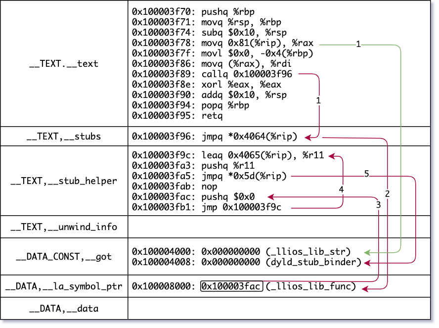

# How does dynamic linking works?

This article is trying to explain how dynamic linking works at the Mach-O level. If you're not familiar with Mach-O format, you can read the content in [`macho_parser`](https://github.com/qyang-nj/llios/tree/main/macho_parser) first.

## Assembly
Although mastering assembly is certainly not required, we will encounter two basic addressing concepts later.

### RIP-Relative Addressing
RIP-Relative Addressing is an addressing mode in the form of `offset(%rip)`. The actual address is `%rip + offset`. It's worth noting that `%rip` always points to the the next instruction.

For example, the following instruction is at address `0x3f96`. The size of `jmpq`instruction is 6 bytes. At the moment of executing this instruction, the value of `$rip` is `0x3f9c` (0x3f96 + 0x6). Thus the program will jump to address `0x401c` (0x3f9c + 0x80).
```
0000000000003f96    jmpq    0x80(%rip)
```

### Indirect Addressing
The notation of indirect addressing has a leading asterisk(`*`). The aforementioned instruction will jump directly to `0x401c`, while the following instruction will jump to the address stored at `0x401c`.
```
0000000000003f96    jmpq    *0x80(%rip)
```
Indirect address can be broken down to two steps: 1. read the value at the specified address; 2. use the value as the target address.

## Sample Code
First, let's build a simple dylib example. In the main function, we are accessing a global variable (`llios_lib_str`) and calling a function (`llios_lib_func`) defined in a dylib built from `lib.c`.

```c
// lib.c
#include <stdio.h>

char *llios_lib_str = "str";
void llios_lib_func(char *str) {
    printf("%s\n", str);
}

```

``` c
// main.c
extern char *llios_lib_str;
extern void llios_lib_func(char *);

int main() {
    llios_lib_func(llios_lib_str);
    return 0;
}

```
*(The sample code and build script are in this directory. It's better to build the code by yourself and follow along the article.)*

Then we disassemble the `__text` section (where the code exist) by `otool`. This is the body of `main` function.

``` bash
$ otool -tv a.out
a.out:
(__TEXT,__text) section
_main:
0000000100003f70	pushq	%rbp
0000000100003f71	movq	%rsp, %rbp
0000000100003f74	subq	$0x10, %rsp
0000000100003f78	movq	0x81(%rip), %rax
0000000100003f7f	movl	$0x0, -0x4(%rbp)
0000000100003f86	movq	(%rax), %rdi
0000000100003f89	callq	0x100003f96
0000000100003f8e	xorl	%eax, %eax
0000000100003f90	addq	$0x10, %rsp
0000000100003f94	popq	%rbp
0000000100003f95	retq
```

## Non-lazy binding
The first interesting part is line 4: `movq	0x81(%rip), %rax`, which accesses the value at `0x81(%rip)`. Use the knowledge of RIP-relative addressing mentioned before, we know `0x81(%rip)` is `0x100004000` (0x100003f7f + 0x81), which is in the `__got` section.

```
$ otool -s __DATA_CONST __got a.out
a.out:
Contents of (__DATA_CONST,__got) section
0000000100004000	00 00 00 00 00 00 00 00 00 00 00 00 00 00 00 00
```

The `__got` section is the global offset table, a table for non-lazy imported globals. This section contains an array of 64-bit pointers. In this case there are two elements. Each element is associated to an indirect symbol. (For how indirect symbol works, check [here](.../macho_parser#indirect-symbol-table).)

```
$ otool -Iv a.out
...
Indirect symbols for (__DATA_CONST,__got) 2 entries
address            index name
0x0000000100004000     4 _llios_lib_str
0x0000000100004008     5 dyld_stub_binder
...
```

The values in `__got` are all 0x0 in the file, because we don't know the values during compilation. `dyld`, at launch time, finds non-lazy symbols in the dylibs and write the addresses into the section. At the moment of accessing `_llios_lib_str`, a valid address is already there (at 0x100004000). Global variables are non-lazily bound while functions are usually lazily bound.

Another symbol in `__got` is `dyld_stub_binder`. We will get there in a moment.


## Lazy binding
Another interesting line is line 7: `callq	0x100003f96`. From `main.c`, we know the only method is called is `llios_lib_func`, so this line must be calling into it. Let's verify it.

`0x100003f96` is in the `__stubs` section. There is only one `jmpq` instruction, because in this example there is only one imported global function.
```
$ otool -v -s __TEXT __stubs a.out
Contents of (__TEXT,__stubs) section
0000000100003f96	jmpq	*0x4064(%rip)
```

Please note here is indirect addressing. The target address is stored at `0x100008000` (0x100003f96 + 0x6 + 0x4064, where 0x6 is the size of `jmpq` instruction). Where is `0x100008000` then? It's in the `__la_symbol_ptr` section.
```
$ otool -s __DATA __la_symbol_ptr a.out
Contents of (__DATA,__la_symbol_ptr) section
0000000100008000	ac 3f 00 00 01 00 00 00
```

Same as `__got` section, `__la_symbol_ptr` is also an array 64-bit pointers which are associated to indirect symbols. Using the same approach, we know `0x100008000` is indeed for the symbol `_llios_lib_func`. This confirms our guess.
```
$ otool -I a.out
Indirect symbols for (__DATA,__la_symbol_ptr) 1 entries
address            index name
0x0000000100008000     3 _llios_lib_func
```

Different from `__got`, the current value of `0x8000` is not `0x0`. Instead it's `0x100003fac` (endianness). Interestingly, `0x100003fac` is in the section `__stub_helper`.
```
$ otool -v -s __TEXT __stub_helper a.out
Contents of (__TEXT,__stub_helper) section
0000000100003f9c	leaq	0x4065(%rip), %r11          <-- line 1
0000000100003fa3	pushq	%r11
0000000100003fa5	jmpq	*0x5d(%rip)                 <-- line 3
0000000100003fab	nop
0000000100003fac	pushq	$0x0                        <-- line 5
0000000100003fb1	jmp	0x100003f9c
```
Please note that `0x100003fac` is at line 5. Following the code, the program jumps to `0x100003f9c` which is line 1. Eventually it gets to line 3 and jumps to `*0x5d(%rip)` (indirect addressing again). We should be good at this now. `0x5d(%rip)` is `0x100004008` (0x100003fab + 0x5d). It seems we have seen this location before. Yes, it's the 2nd element in `__got`, which is `dyld_stub_binder`. As you may still remember, `__got` is the non-lazy binding section and the address of `dyld_stub_binder` will be written there at launch time.

Basically, `callq	0x100003f96` (the one supposed to call `llios_lib_func`) instruction actually calls into [`dyld_stub_binder`](https://opensource.apple.com/source/dyld/dyld-195.5/src/dyld_stub_binder.s.auto.html). This is a special method, provided by `dyld`, finds the address of the symbol (it's `_llios_lib_func` in our case), writes the address back to the `__la_symbol_ptr` section, jumps to the real fucntion.

Here is what happens when calling a method in a dylib. The program calls into code in (__TEXT,__stub) which reads the address stored in `__la_symbol_ptr` and jumps to that. At the first time, that address is pointing to (__TEXT,__stub_helper) which in turn calls into `dyld_stub_binder`. `dyld_stub_binder` finds the symbol in the dylib, writes it back to `__la_symbol_ptr` and jumps to the real method. Next time calling the same method, `__la_symbol_ptr` has the real address, so the program can jump to it directly.

The following diagram is a quick recap. The green arrow is non-lazy binding and the red arrows are the lazy binding flows (first time access).

