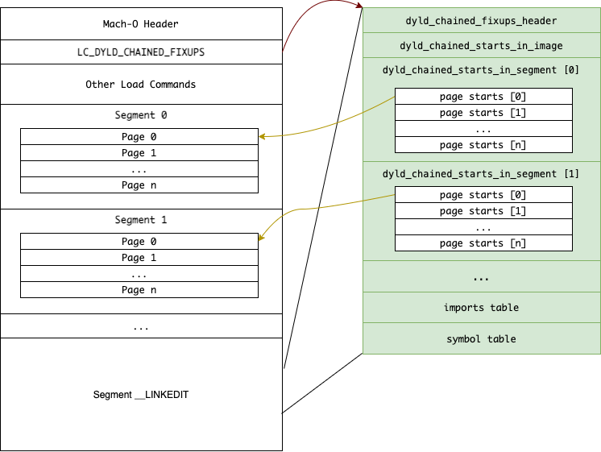

# Chained Fixups
Chained fixups is a new way to store information that will be used by `dyld`. Replacing `LC_DYLD_INFO`, the chained fixups can save binary size and reduce launch time.

Traditionally, `dyld`, at launch time, needs to slide the fixed addresses with a random number, known as ASLR. This operation is called rebasing. Also, `dyld` needs to connect symbols from current binary with its linked dynamic libraries. This is called binding. Under the new format, both rebasing and binding have a new name, **fixup**, because they need to be "fixed up" before main function.

Chained fixups is [enabled by default if the binary is built for device and targeted at iOS 14+](https://github.com/qyang-nj/llios/blob/1f111edc87adbca68c336d3ab501e3ca4a1f2356/apple_open_source/ld64/src/ld/Options.cpp#L5233-L5238). We can also manually enable it by passing `-fixup_chains` to `ld`.

## `LC_DYLD_CHAINED_FIXUPS` and `LC_DYLD_EXPORTS_TRIE`
Once chained fixups is enabled, a Mach-O binary on longer uses `LC_DYLD_INFO`. Instead, it has two new load commands, `LC_DYLD_CHAINED_FIXUPS` and `LC_DYLD_EXPORTS_TRIE`. Interestingly, the lazy binding section `__DATA,__la_symbol_ptr` is gone too.

A quick recap of the old `LC_DYLD_INFO`. It contains four types of information:
* rebase -- addresses that need to be shifted by ASLR
* bind -- non-lazy bind symbols that are bound at launch time
* lazy bind -- lazy bind symbols that are bound at the first time of usage
* export -- exported symbols that are provided by this binary

In the new chained fixups, the export is moved to the new `LC_DYLD_EXPORTS_TRIE` load command but keeps the same trie format. The rebase and bind are chained together and are moved to `LC_DYLD_CHAINED_FIXUPS`. The lazy bind becomes bind (no more lazy binding)! As I have explained the export trie in detail [here](../exported_symbol/README.md), this article will focus on the `LC_DYLD_CHAINED_FIXUPS`.

## Layout
Since the format is new, I couldn't find any articles explaining the technical details. The best documentation I found is Apple source code, [mach-o/fixup-chain.h](https://github.com/qyang-nj/llios/blob/d204d56ff0533c1fae115b77e7554d2e6f4bc4aa/apple_open_source/dyld/include/mach-o/fixup-chains.h) and [otool/dylib_bind_info.c](https://github.com/qyang-nj/llios/blob/d204d56ff0533c1fae115b77e7554d2e6f4bc4aa/apple_open_source/cctools/otool/dyld_bind_info.c#L2906).

`LC_DYLD_CHAINED_FIXUPS` begins with `dyld_chained_fixups_header`, followed by `dyld_chained_starts_in_image`, which indicates the number of segment and where their `dyld_chained_starts_in_segment` are. The number of segment here equals to the number of `LC_SEGMENT_64`. Each `dyld_chained_starts_in_segment` contains an array of "page starts" of each page in the segment. A "page starts" is the first fixup in the page. The next fixup is at the location of current one + `next` field * 4. Each fixup is 64 bits and is either a rebase or a bind, indicated by the lowest bit. It's difficult to explain in plain text but relatively straightforward to read the code. The full parsing logic can be found [here](../macho_parser/sources/chained_fixups.c).



## Advantages

### It saves binary size
Previously with `LC_DYLD_INFO`, non-lazy bind addresses are always 64-bit 0x0 in the file, and the binding info are stored in a separate table in `__LINKEDIT`. (Read [this](./README.md) for more details.) This means those space with 0x0 are not efficiently used. With chained fixups, those addresses now store their own the binding information in 64 bit and the extra table is more compact. It's similar for rebase as well. In the Airbnb app I measured, the new format saves 1.4 MB.

```
# With traditional `LC_DYLD_INFO`, the `__got` section of `/bin/ls` are all zeros.
$ otool -s __DATA __got /bin/ls
/bin/ls:
Contents of (__DATA,__got) section
0000000100008008	00 00 00 00 00 00 00 00 00 00 00 00 00 00 00 00
0000000100008018	00 00 00 00 00 00 00 00 00 00 00 00 00 00 00 00
0000000100008028	00 00 00 00 00 00 00 00 00 00 00 00 00 00 00 00
```

### It reduces launch time
The rebase and bind data are chained together and organized by pages. It provides the ability to rebase address and bind symbols for any given pages independently. What does this entail? **It enables dyld to skip the mandatory fixups at launch time and only do it when the page is loaded (aka page fault). Basically they all become lazy rebasing and binding.** That's why there is no need for traditional lazy binding.

## Inspection

Unlike `LC_DYLD_INFO`, `LC_DYLD_CHAINED_FIXUPS` can not be inspected by `dyldinfo` at this moment. You can use `otool -fixup_chains`, but it only shows imports, not rebase. My [macho parser](../macho_parser#mach-o-parser) is able to print out most of the information, including rebase and bind info of each segment, as well as the imports table.
```
$ macho_parser/parser -c LC_DYLD_CHAINED_FIXUPS -v ../macho_parser/sample.out

LC_DYLD_CHAINED_FIXUPS cmdsize: 16     dataoff: 0xc000 (49152)   datasize: 296
    CHAINED FIXUPS HEADER
    fixups_version : 0
    starts_offset  : 0x20 (32)
    imports_offset : 0x68 (104)
    symbols_offset : 0x84 (132)
    imports_count  : 7
    imports_format : 1 (DYLD_CHAINED_IMPORT)
    symbols_format : 0 (UNCOMPRESSED)

    IMPORTS
    [0] lib_ordinal: 1   weak_import: 0   name_offset: 1 (_objc_opt_self)
    [1] lib_ordinal: 3   weak_import: 0   name_offset: 16 (_swift_allocObject)
    [2] lib_ordinal: 3   weak_import: 0   name_offset: 35 (_swift_deallocClassInstance)
    [3] lib_ordinal: 1   weak_import: 0   name_offset: 63 (__objc_empty_cache)
    ...

    SEGMENT 3 (offset: 48)
    size: 24
    page_size: 0x4000
    pointer_format: 2 (DYLD_CHAINED_PTR_64)
    segment_offset: 0x8000
    max_valid_pointer: 0
    page_count: 1
    page_start: 24
        SEGMENT 3, PAGE 0 (offset: 24)
        0x00008018 REBASE   target: 0x100003f10   high8: 0
        0x00008060 REBASE   target: 0x100003f10   high8: 0
        0x00008090 BIND     ordinal: 4   addend: 0    reserved: 0   (_OBJC_METACLASS_$__TtCs12_SwiftObject)
        0x00008098 BIND     ordinal: 4   addend: 0    reserved: 0   (_OBJC_METACLASS_$__TtCs12_SwiftObject)
        0x000080a0 BIND     ordinal: 3   addend: 0    reserved: 0   (__objc_empty_cache)
        ...
```

## Learn more
* [How iOS 15 makes your app launch faster](https://medium.com/geekculture/how-ios-15-makes-your-app-launch-faster-51cf0aa6c520)
